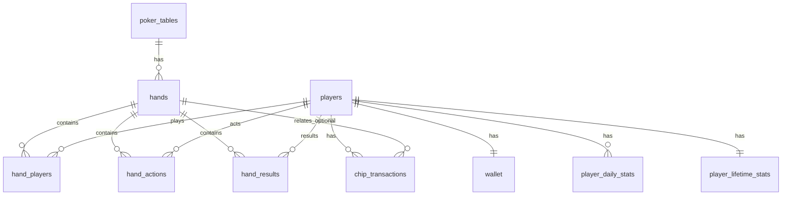

# 数据库设计

本项目使用 SQLite 存储在线多人德州扑克的：

- 玩家账号与钱包（筹码）
- 每一手牌（hand）的参与者、动作流水、结算结果（用于复盘/统计）
- 当日实时榜单统计、历史累计统计（bb/100 与风格画像）
- 筹码变动流水（每日重置 / 自动补充 / 管理员调整）

> 约定：启用外键约束
> `PRAGMA foreign_keys = ON;`

---

## 1. 数据库表与职责

| 表名                    | 作用                                                 | 关键字段                                                        |
| ----------------------- | ---------------------------------------------------- | --------------------------------------------------------------- |
| `players`               | 玩家基础信息（登录/头像/昵称等）                     | `id, username, password_hash`                                   |
| `wallet`                | 玩家当前可用筹码（用于下注与前端显示）               | `player_id, chips, last_reset_date`                             |
| `chip_transactions`     | 筹码流水（重置/补充/调整），用于审计与真实净值计算   | `player_id, tx_type, amount, tx_date, hand_id`                  |
| `poker_tables`          | 牌桌/房间信息                                        | `id, max_seats`                                                 |
| `hands`                 | 一手牌（完整一局）的公共信息（盲注、公共牌、时间）   | `id, table_id, small_blind, big_blind, started_at`              |
| `hand_players`          | 每手牌参与者快照（座位、起止筹码、盲注、是否sitout） | `(hand_id, player_id), seat_no, starting_stack, ending_stack`   |
| `hand_actions`          | 每手牌动作流水（用于复盘与统计画像）                 | `hand_id, player_id, street, action_order, action_type, amount` |
| `hand_results`          | 每手牌结算（赢家/赢得金额/摊牌信息）                 | `(hand_id, player_id), is_winner, win_amount, show_down`        |
| `player_daily_stats`    | 当日统计缓存（用于实时排行榜：当日净胜/手数）        | `(stat_date, player_id), net_chips, net_bb`                     |
| `player_lifetime_stats` | 历史累计（bb/100、风格画像、总积分等）               | `player_id, hands_played, net_bb, vpip_hands...`                |
| `api_keys`              | 游戏中可能使用到的第三方apikey管理                   | `id, servername, api_key`                                       |

---

## 2. 表之间的关系（ER Diagram）

